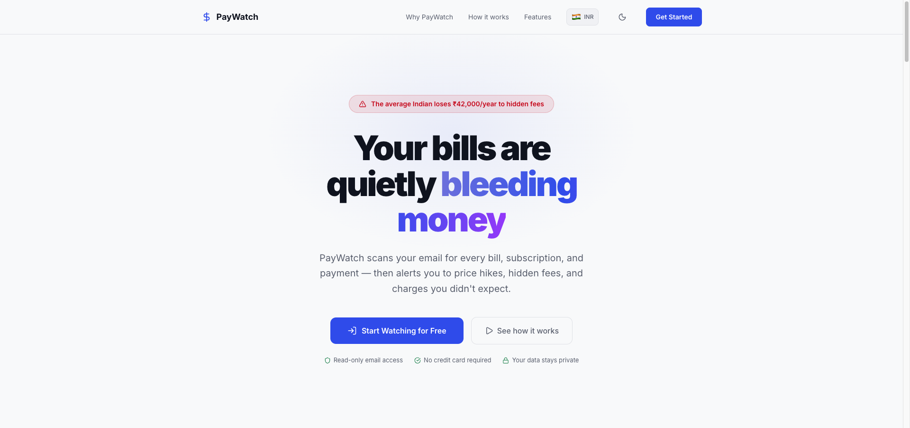
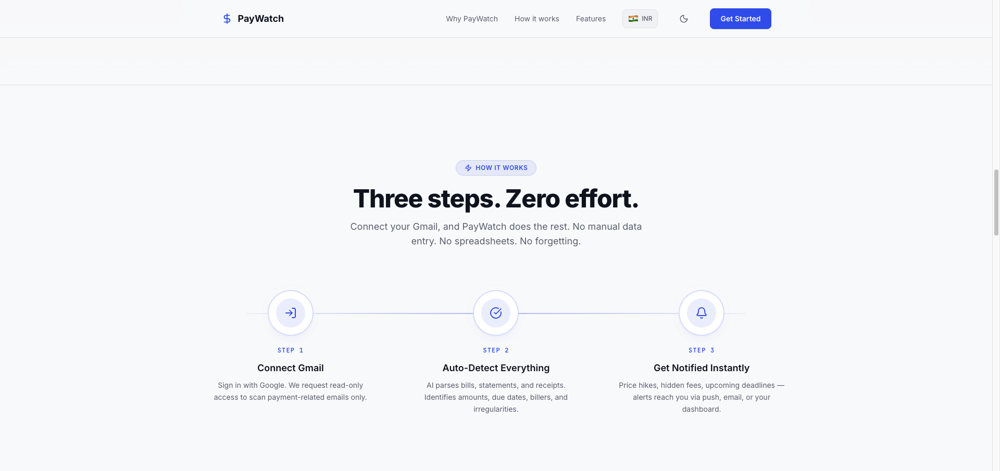
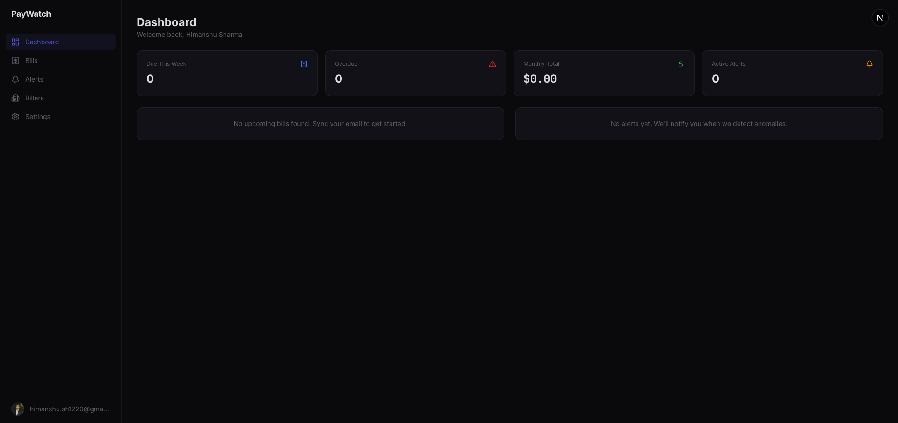
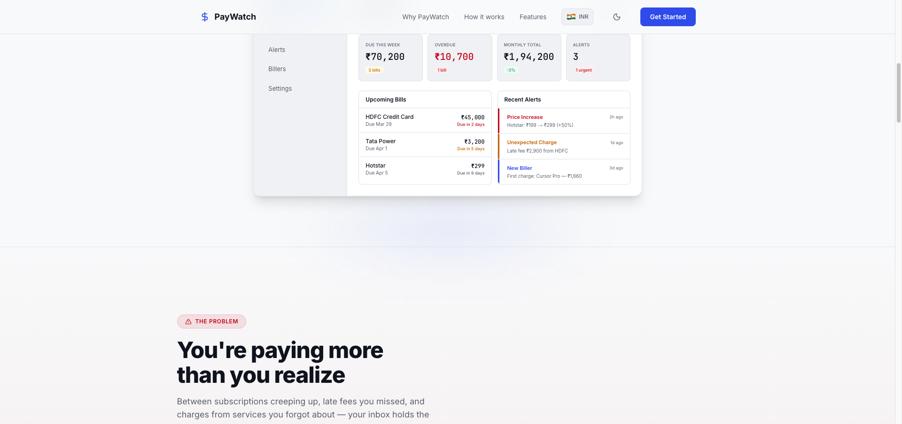
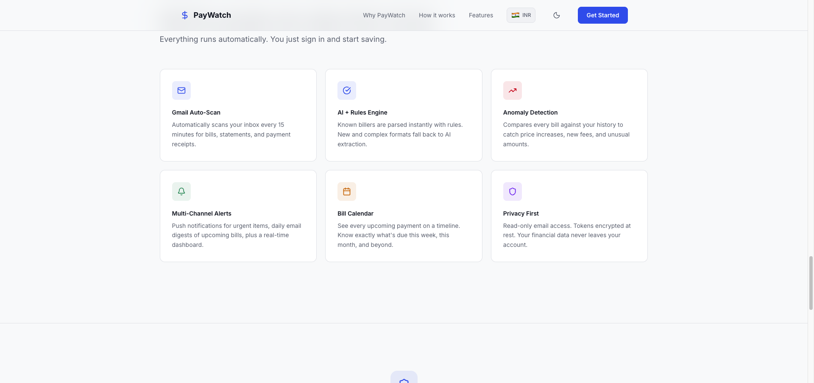

# PayWatch

**Your bills are quietly bleeding money.** PayWatch connects to your Gmail, automatically scans for every bill, subscription, and payment, and alerts you to price hikes, hidden fees, and charges you didn't expect.

[](https://paywatch.sh-himanshu.com)
[](https://nextjs.org)
[](https://www.typescriptlang.org)
[](https://vercel.com)

---



## How It Works

PayWatch follows three simple steps:

1. **Connect Gmail** -- Sign in with Google. We request read-only access to scan payment-related emails only.
2. **Auto-Detect Everything** -- AI parses bills, statements, and receipts. Identifies amounts, due dates, billers, and irregularities.
3. **Get Notified Instantly** -- Price hikes, hidden fees, upcoming deadlines -- alerts reach you via push, email, or your dashboard.



## Dashboard

A dark-mode dashboard gives you a complete overview of your financial obligations at a glance -- due this week, overdue bills, monthly totals, and active alerts.





## Features

| Feature | Description |
|---|---|
| **Gmail Auto-Scan** | Automatically scans your inbox for bills, statements, and payment receipts |
| **AI + Rules Engine** | Known billers are parsed instantly with rules. New and complex formats fall back to AI extraction |
| **Anomaly Detection** | Compares every bill against your history to catch price increases, new fees, and unusual amounts |
| **Multi-Channel Alerts** | Push notifications for urgent items, daily email digests, plus a real-time dashboard |
| **Bill Calendar** | See every upcoming payment on a timeline. Know what's due this week, this month, and beyond |
| **Privacy First** | Read-only email access. Tokens encrypted at rest. Your financial data never leaves your account |



## Supported Billers

PayWatch comes with built-in rule-based parsers for popular billers across US and India:

**US:** Netflix, Spotify, Chase, Amex, Con Edison, AT&T, Verizon, AWS, Google Cloud, Adobe

**India:** Hotstar, Spotify, HDFC, SBI, Tata Power, Jio, Airtel, AWS, Google Cloud, Adobe

Any unrecognized biller is handled by the OpenAI-powered LLM fallback parser.

## Tech Stack

| Layer | Technology |
|---|---|
| Framework | [Next.js 16](https://nextjs.org) (App Router) |
| Language | TypeScript 5 |
| Database & Auth | [Supabase](https://supabase.com) (PostgreSQL + Google OAuth) |
| Email Integration | Google Gmail API (read-only) |
| AI/LLM | [OpenAI](https://openai.com) (bill parsing fallback) |
| Transactional Email | [Resend](https://resend.com) |
| Push Notifications | Web Push (VAPID) |
| Styling | Tailwind CSS v4 |
| Animations | [Motion](https://motion.dev) |
| Icons | [Lucide React](https://lucide.dev) |
| Linting | [Biome](https://biomejs.dev) |
| Hosting | [Vercel](https://vercel.com) |

## Getting Started

### Prerequisites

- [Node.js 20+](https://nodejs.org)
- [pnpm](https://pnpm.io)
- A [Supabase](https://supabase.com) project with Google OAuth configured
- [OpenAI API key](https://platform.openai.com)
- [Resend API key](https://resend.com) (for email digests)

### Setup

1. **Clone the repository**

   ```bash
   git clone https://github.com/sh-himanshu/pay-watch.git
   cd pay-watch
   ```

2. **Install dependencies**

   ```bash
   pnpm install
   ```

3. **Configure environment variables**

   ```bash
   cp .env.local.example .env.local
   ```

   Fill in the values:

   ```env
   # Supabase
   NEXT_PUBLIC_SUPABASE_URL=https://your-project.supabase.co
   NEXT_PUBLIC_SUPABASE_ANON_KEY=your-anon-key
   SUPABASE_SERVICE_ROLE_KEY=your-service-role-key

   # OpenAI (LLM fallback parser)
   OPENAI_API_KEY=sk-your-openai-key

   # Resend (email digests)
   RESEND_API_KEY=re_your-resend-key

   # Web Push (generate with: npx web-push generate-vapid-keys)
   NEXT_PUBLIC_VAPID_PUBLIC_KEY=your-vapid-public-key
   VAPID_PRIVATE_KEY=your-vapid-private-key

   # Cron security
   CRON_SECRET=your-random-secret-string
   ```

4. **Run database migrations**

   Apply the SQL migrations in `supabase/migrations/` to your Supabase project.

5. **Start the dev server**

   ```bash
   pnpm dev
   ```

   Open [http://localhost:3000](http://localhost:3000) to see the app.

## Project Structure

```
pay-watch/
├── app/                    # Next.js App Router pages
│   ├── page.tsx            # Landing page
│   ├── login/              # Google OAuth login
│   ├── dashboard/          # Protected dashboard routes
│   │   ├── page.tsx        # Dashboard overview
│   │   ├── bills/          # Bills list
│   │   ├── alerts/         # Active alerts
│   │   ├── billers/        # Detected billers
│   │   └── settings/       # Notification preferences
│   └── api/                # API routes & cron jobs
│       ├── sync/           # Manual email sync
│       ├── cron/           # Scheduled sync, reminders, digests
│       ├── alerts/         # Alert dismiss/read actions
│       └── push/           # Push notification subscription
├── components/             # React components
├── lib/                    # Core logic
│   ├── biller-rules.ts     # Rule-based parsers for known billers
│   ├── services/           # Email sync, parsing, alerts, push
│   ├── supabase/           # Supabase client variants
│   └── types.ts            # TypeScript type definitions
├── supabase/migrations/    # Database schema migrations
└── public/                 # Static assets
```

## Cron Jobs

PayWatch uses three scheduled cron jobs (configured in `vercel.json`):

| Schedule | Endpoint | Description |
|---|---|---|
| Daily at midnight | `/api/cron/sync-all` | Syncs all connected email accounts |
| Daily at 8:00 AM | `/api/cron/reminders` | Sends push notifications for upcoming/overdue bills |
| Daily at 8:00 AM | `/api/cron/digest` | Sends daily/weekly email digest summaries |

## License

MIT
